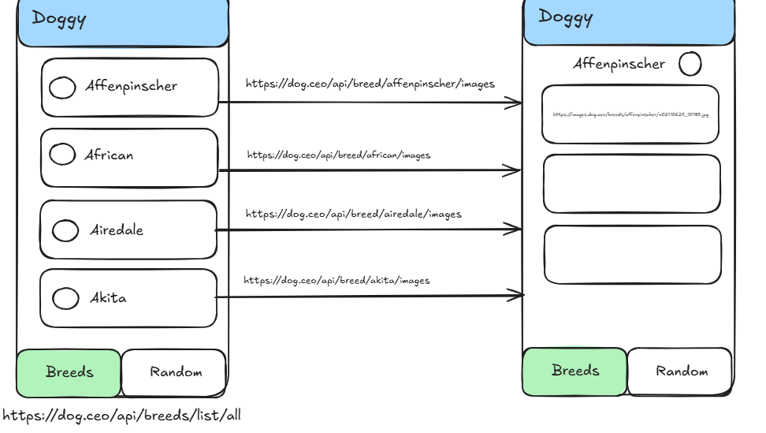
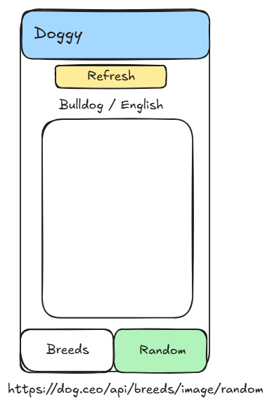

# 🐕 Doggy Ionic

Una aplicación móvil para explorar diferentes razas de perros, desarrollada con Ionic y Angular.

## 📱 Información de la App

Doggy App es una aplicación que permite visualizar listas de razas de perros y explorar razas aleatorias, desarrollada usando IONIC Capacitor.

### 🛠️ Tecnologías
- **Angular**: 20
- **Ionic**: 7.0.0
- **Node.js**: 22.18.0
- **Capacitor**: Para funcionalidad nativa

## 🚀 Setup del Proyecto

### Prerrequisitos
- Node.js 22.18.0 o superior
- npm o yarn
- Ionic CLI

### Instalación
```bash
# Clonar el repositorio
git clone https://github.com/victormugo/doggy_ionic.git
cd doggy_ionic

# Instalar dependencias
npm install

# Instalar Ionic CLI globalmente (si no lo tienes)
npm install -g @ionic/cli

# Ejecutar en modo desarrollo
ionic serve
```

### 📱 Ejecutar en dispositivos
```bash
# Para iOS
ionic capacitor add ios
ionic capacitor run ios

# Para Android
ionic capacitor add android
ionic capacitor run android
```

## 🔧 Mantenimiento

### Actualizar dependencias
```bash
# Verificar dependencias desactualizadas
npm outdated

# Actualizar Angular y dependencias relacionadas
ng update

# Actualizar todas las dependencias de npm
npm update

# Actualizar Ionic
npm install @ionic/angular@latest @ionic/cli@latest
```

### Auditoría de seguridad
```bash
# Verificar vulnerabilidades
npm audit

# Corregir vulnerabilidades automáticamente
npm audit fix
```

## 📊 Diagrama de la Aplicación

### 🏠 Primera pestaña - Lista de razas
Muestra una lista completa de todas las razas de perros disponibles.



### 🎲 Segunda pestaña - Razas aleatorias  
Presenta razas de perros de forma aleatoria para descubrir nuevas opciones.



## 🏗️ Estructura del Proyecto
```
doggy_ionic/
├── src/
│   ├── app/
│   │   ├── tabs/
│   │   ├── services/
│   │   └── components/
│   ├── assets/
│   └── environments/
├── android/
├── ios/
└── capacitor.config.ts
```

## 🤝 Contribución

Las contribuciones son bienvenidas. Por favor:

1. Fork el proyecto
2. Crea una rama para tu feature (`git checkout -b feature/AmazingFeature`)
3. Commit tus cambios (`git commit -m 'Add some AmazingFeature'`)
4. Push a la rama (`git push origin feature/AmazingFeature`)
5. Abre un Pull Request

## 📞 Soporte

Para soporte técnico o consultas sobre el proyecto:

**📧 Email**: victormugo@gmail.com

## 📄 Licencia

Este proyecto está bajo la Licencia MIT. Ver el archivo `LICENSE` para más detalles.

## 🔄 Changelog

### v1.0.0
- ✅ Implementación inicial
- ✅ Lista de razas de perros
- ✅ Funcionalidad de razas aleatorias
- ✅ Interfaz con Ionic 7
- ✅ Integración con Angular 19

---

⭐ Si te gusta este proyecto, ¡dale una estrella en GitHub!